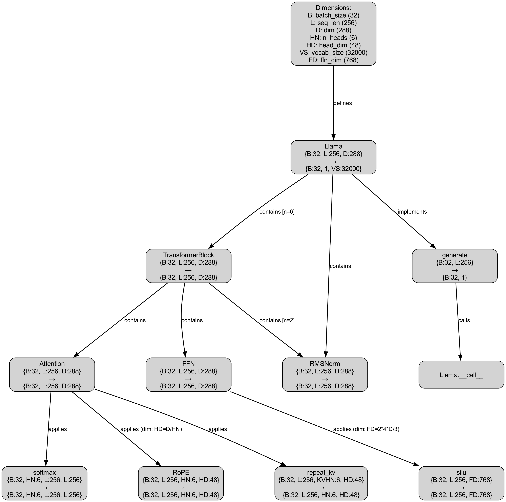

# llama3 numpy implementation study


## Components




### sample breakdown of generation using -
```
python llama3.py --batch-size 32 'once upon a time'

generate.iteration                       254          5015.73ms    19.75ms    18.3%
  llama.total                            254          4345.36ms    17.11ms    15.9%
    llama.final                          254          2983.80ms    11.75ms    10.9%
      llama.embedding                    254             0.35ms     0.00ms     0.0%
      llama.freqs                        254             0.00ms     0.00ms     0.0%
      llama.mask                         254             0.05ms     0.00ms     0.0%
      llama.norm                         254             2.70ms     0.01ms     0.0%
      llama.head                         254          2977.02ms    11.72ms    10.9%
    llama.layers                         254          1358.31ms     5.35ms     5.0%
      transformer_block.total            1524         1354.35ms     0.89ms     5.0%
        transformer_block.feedforward    1524          945.20ms     0.62ms     3.5%
        transformer_block.attention      1524          381.74ms     0.25ms     1.4%
  do_sampling.compute                    254           658.56ms     2.59ms     2.4%
    top_p_logits.compute                 254           552.27ms     2.17ms     2.0%
    sampling.compute                     254            80.34ms     0.32ms     0.3%
```

### llama.head

what is it?
```
large matrix multiplication: [B, 1, D] @ [D, VS] → [B, 1, VS]
[B, 1, D] @ [D, VS] → [B, 1, VS]
= 32 (batch) × 288 (hidden) × 32000 (vocab)
= 294,912,000 floating-point operations
```

why expensive ?
- loads the entire vocabulary matrix (288 × 32000 ≈ 9.2M parameters)
- output is large (32 × 32000 = 1M logits)
- runs on every generation step

### Other key operations
   - RoPE for position encoding
   - Softmax for attention scores
   - SiLU activation in FFN

### experiment results
- [softmax-with-numba-results](benchmark_results/benchmark_softmax_20250304_195251_summary.txt)
- [model-generation-time-breakdown](experiment_results/llama_run_20250304_195049_summary.txt)
